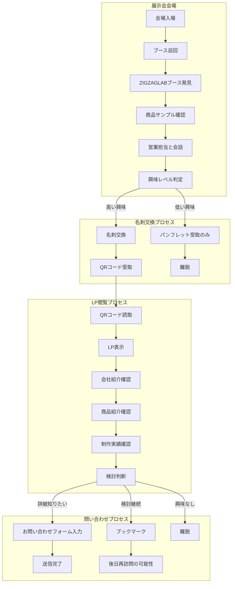

# 第1フェーズ アクティビティ図（展示会向けLP）

## リビジョン履歴

| version | date | Auther | Summary | Status | Reviewer |
|------------|------|--------|----------|----------|--------|
| v1.0 | 2025-07-20 | 山下 | 初版作成 | 🔄 レビュー中 | 橋本さん | 

##  来場者の詳細行動フロー

