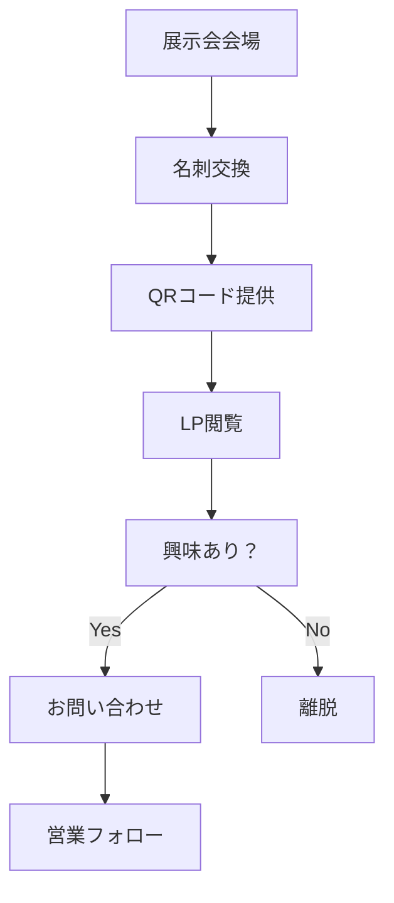
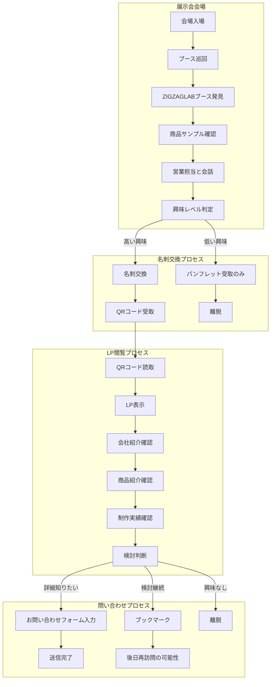
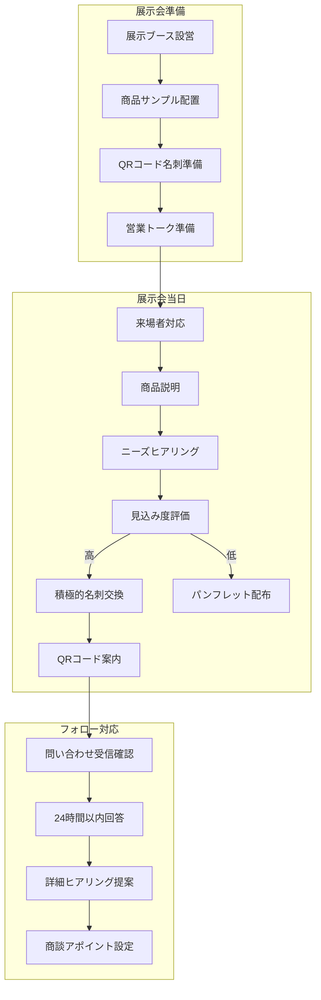
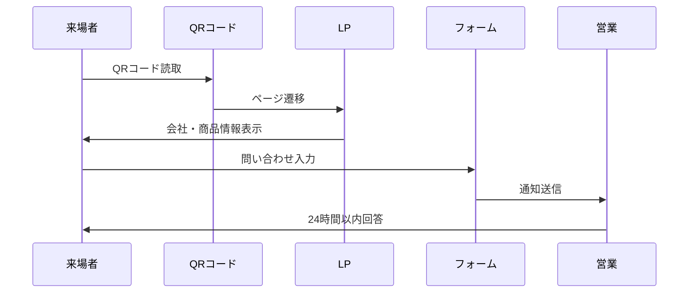

# 第1フェーズ アクティビティ図（展示会向けLP）

## リビジョン履歴

| バージョン | 日付 | 変更者 | 変更内容 | 承認状況 | 承認者 | 次回レビュー予定 |
|------------|------|--------|----------|----------|--------|------------------|
| v1.0 | 2025-07-20 | bizPM | 初版作成 | 🔄 レビュー中 | 橋本さん（クライアント代表者） | 次回ミーティング時 |

## 1. フェーズ概要

**目的**: 展示会での名刺交換後のフォローアップツール  
**期間**: 2025年6月〜7月（完了済み）  
**ターゲット**: 展示会来場者（BtoB見込み顧客）  
**成果物**: 静的ランディングページ

---

## 2. 簡易版（30秒〜2分理解）

### 2.1 基本フロー概要

### 2.2 主要ステークホルダー行動

| ステークホルダー | 主要アクション | 目標 |
|------------------|----------------|------|
| **展示会来場者** | 1. ブース訪問 → 2. LP閲覧 → 3. 問い合わせ | 情報収集・検討材料入手 |
| **ZIGZAGLAB営業** | 1. 名刺交換 → 2. QR提供 → 3. フォロー連絡 | 見込み顧客獲得 |

### 2.3 成功指標
- 名刺交換数: 50件/展示会
- LP閲覧率: 30%（15件）
- 問い合わせ率: 20%（3件）

---

## 3. 詳細版（2分〜5分理解）

### 3.1 来場者の詳細行動フロー

### 3.2 ZIGZAGLAB側の対応フロー

### 3.3 システム側の処理フロー

### 3.4 詳細な成功指標とKPI

| 指標カテゴリ | 指標名 | 目標値 | 測定方法 |
|--------------|--------|--------|----------|
| **認知・関心** | 名刺交換数 | 50件/展示会 | 手動カウント |
| **アクセス** | LP閲覧数 | 15件（30%） | GA4 |
| **エンゲージメント** | 平均滞在時間 | 2分以上 | GA4 |
| **コンバージョン** | 問い合わせ数 | 3件（20%） | フォーム送信数 |
| **品質** | 商談化率 | 66%（2件） | 営業追跡 |

### 3.5 課題と改善点

#### 想定される課題
1. **QRコード読取率**: 高齢層の来場者はQR操作に不慣れ
2. **LP表示速度**: 展示会場のWiFi環境による遅延
3. **情報量**: 限られた時間での情報伝達効率

#### 対策
1. **QR代替手段**: URL記載の名刺も併用
2. **軽量化**: 画像最適化、最小限のJS使用
3. **情報優先度**: 重要情報を上部配置

### 3.6 次フェーズへの橋渡し

**第2フェーズへの移行要素**:
- 展示会で得た顧客ニーズ情報
- LP閲覧行動データ
- 問い合わせ内容の分析結果
- 営業担当のフィードバック

これらの情報を基に、第2フェーズのtoB向けHPで不足機能を補完する。