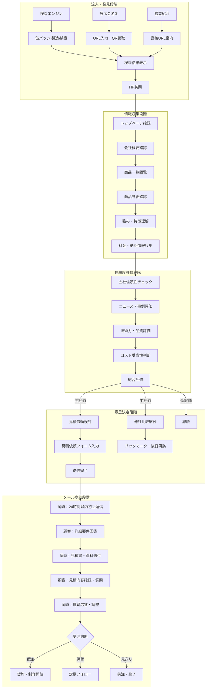

# 第2フェーズ アクティビティ図（toB向けホームページ）

## リビジョン履歴

| version | date | Auther | Summary | Status | Reviewer |
|------------|------|--------|----------|----------|--------|
| v1.0 | 2025-07-20 | 山下 | 初版作成 | 🔄 レビュー中 | 橋本さん | 
| v1.1 | 2025-07-22 | 山下 | プロジェクトスコープに基づく機能調整、メールフロー追加 | 🔄 レビュー中 | 橋本さん | 

## 企業顧客の行動フロー

