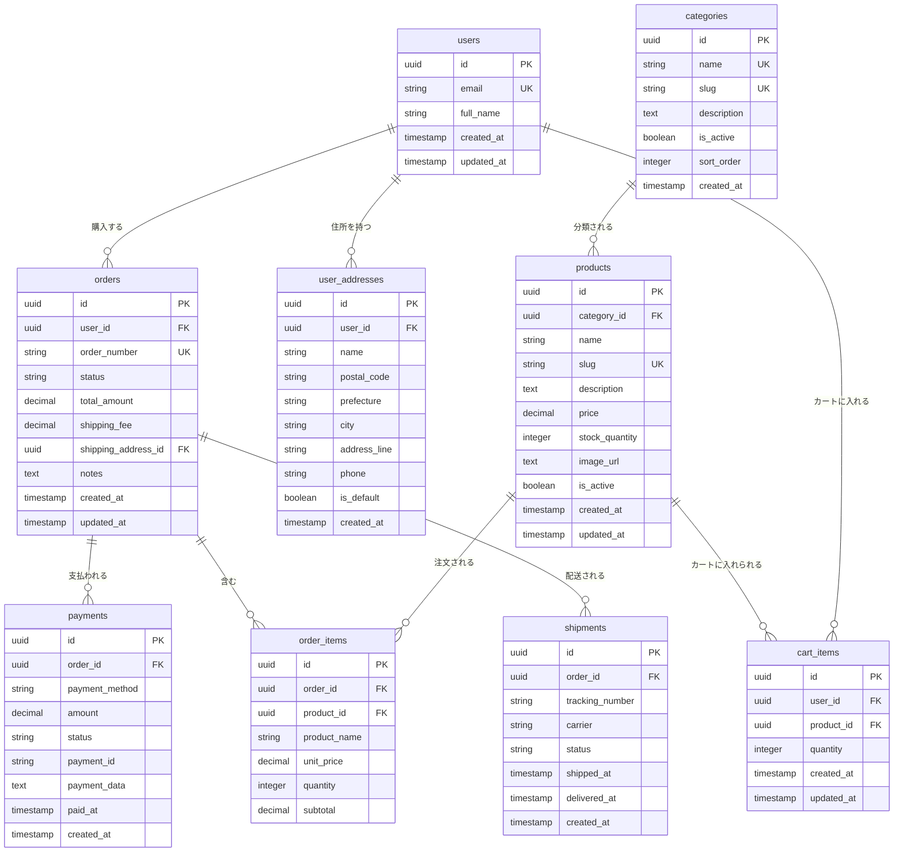

# 第3フェーズ ER図・データベース設計

## リビジョン履歴

| バージョン | 日付 | 変更者 | 変更内容 | 承認状況 | 承認者 | 次回レビュー予定 |
|------------|------|--------|----------|----------|--------|------------------|
| v1.0 | 2025-07-20 | techPM | 初版作成 | 🔄 レビュー中 | 橋本さん（クライアント代表者） | 次回ミーティング時 |

## 1. 概要

**対象フェーズ**: 第3フェーズ（toC向けECサイト）  
**データベース**: Supabase PostgreSQL  
**設計方針**: 必要最低限のEC機能に特化、第4フェーズでの拡張を考慮

## 2. ER図



## 3. テーブル設計詳細

### 3.1 ユーザー関連

#### users（ユーザー）
Supabase Authの拡張テーブル

| カラム名 | 型 | 制約 | 説明 |
|----------|----|----|------|
| id | uuid | PK | Supabase Auth users.id |
| email | varchar(255) | UNIQUE, NOT NULL | メールアドレス |
| full_name | varchar(100) | | 氏名 |
| created_at | timestamptz | DEFAULT NOW() | 作成日時 |
| updated_at | timestamptz | DEFAULT NOW() | 更新日時 |

#### user_addresses（ユーザー住所）

| カラム名 | 型 | 制約 | 説明 |
|----------|----|----|------|
| id | uuid | PK | 住所ID |
| user_id | uuid | FK(users), NOT NULL | ユーザーID |
| name | varchar(100) | NOT NULL | 宛名 |
| postal_code | varchar(8) | NOT NULL | 郵便番号 |
| prefecture | varchar(10) | NOT NULL | 都道府県 |
| city | varchar(50) | NOT NULL | 市区町村 |
| address_line | varchar(200) | NOT NULL | 住所詳細 |
| phone | varchar(15) | | 電話番号 |
| is_default | boolean | DEFAULT false | デフォルト住所フラグ |
| created_at | timestamptz | DEFAULT NOW() | 作成日時 |

### 3.2 商品関連

#### categories（商品カテゴリ）

| カラム名 | 型 | 制約 | 説明 |
|----------|----|----|------|
| id | uuid | PK | カテゴリID |
| name | varchar(50) | UNIQUE, NOT NULL | カテゴリ名 |
| slug | varchar(50) | UNIQUE, NOT NULL | URLスラッグ |
| description | text | | 説明 |
| is_active | boolean | DEFAULT true | 有効フラグ |
| sort_order | integer | DEFAULT 0 | 表示順 |
| created_at | timestamptz | DEFAULT NOW() | 作成日時 |

#### products（商品）

| カラム名 | 型 | 制約 | 説明 |
|----------|----|----|------|
| id | uuid | PK | 商品ID |
| category_id | uuid | FK(categories), NOT NULL | カテゴリID |
| name | varchar(255) | NOT NULL | 商品名 |
| slug | varchar(255) | UNIQUE, NOT NULL | URLスラッグ |
| description | text | | 商品説明 |
| price | decimal(10,2) | NOT NULL | 価格 |
| stock_quantity | integer | DEFAULT 0 | 在庫数 |
| image_url | text | | 商品画像URL |
| is_active | boolean | DEFAULT true | 有効フラグ |
| created_at | timestamptz | DEFAULT NOW() | 作成日時 |
| updated_at | timestamptz | DEFAULT NOW() | 更新日時 |

### 3.3 カート関連

#### cart_items（カート商品）

| カラム名 | 型 | 制約 | 説明 |
|----------|----|----|------|
| id | uuid | PK | カートアイテムID |
| user_id | uuid | FK(users), NOT NULL | ユーザーID |
| product_id | uuid | FK(products), NOT NULL | 商品ID |
| quantity | integer | NOT NULL, CHECK > 0 | 数量 |
| created_at | timestamptz | DEFAULT NOW() | 作成日時 |
| updated_at | timestamptz | DEFAULT NOW() | 更新日時 |

**複合UNIQUE制約**: (user_id, product_id)

### 3.4 注文関連

#### orders（注文）

| カラム名 | 型 | 制約 | 説明 |
|----------|----|----|------|
| id | uuid | PK | 注文ID |
| user_id | uuid | FK(users), NOT NULL | ユーザーID |
| order_number | varchar(20) | UNIQUE, NOT NULL | 注文番号 |
| status | varchar(20) | NOT NULL | 注文ステータス |
| total_amount | decimal(10,2) | NOT NULL | 合計金額 |
| shipping_fee | decimal(10,2) | DEFAULT 0 | 送料 |
| shipping_address_id | uuid | FK(user_addresses) | 配送先住所ID |
| notes | text | | 備考 |
| created_at | timestamptz | DEFAULT NOW() | 作成日時 |
| updated_at | timestamptz | DEFAULT NOW() | 更新日時 |

**注文ステータス**: 'pending', 'paid', 'processing', 'shipped', 'delivered', 'cancelled'

#### order_items（注文商品）

| カラム名 | 型 | 制約 | 説明 |
|----------|----|----|------|
| id | uuid | PK | 注文商品ID |
| order_id | uuid | FK(orders), NOT NULL | 注文ID |
| product_id | uuid | FK(products), NOT NULL | 商品ID |
| product_name | varchar(255) | NOT NULL | 商品名（注文時点） |
| unit_price | decimal(10,2) | NOT NULL | 単価（注文時点） |
| quantity | integer | NOT NULL, CHECK > 0 | 数量 |
| subtotal | decimal(10,2) | NOT NULL | 小計 |

### 3.5 決済関連

#### payments（決済）

| カラム名 | 型 | 制約 | 説明 |
|----------|----|----|------|
| id | uuid | PK | 決済ID |
| order_id | uuid | FK(orders), NOT NULL | 注文ID |
| payment_method | varchar(20) | NOT NULL | 決済方法 |
| amount | decimal(10,2) | NOT NULL | 決済金額 |
| status | varchar(20) | NOT NULL | 決済ステータス |
| payment_id | varchar(100) | | 決済プロバイダーID |
| payment_data | jsonb | | 決済詳細データ |
| paid_at | timestamptz | | 決済完了日時 |
| created_at | timestamptz | DEFAULT NOW() | 作成日時 |

**決済方法**: 'credit_card', 'convenience_store', 'bank_transfer'  
**決済ステータス**: 'pending', 'completed', 'failed', 'cancelled'

### 3.6 配送関連

#### shipments（配送）

| カラム名 | 型 | 制約 | 説明 |
|----------|----|----|------|
| id | uuid | PK | 配送ID |
| order_id | uuid | FK(orders), NOT NULL | 注文ID |
| tracking_number | varchar(50) | | 追跡番号 |
| carrier | varchar(50) | | 配送業者 |
| status | varchar(20) | NOT NULL | 配送ステータス |
| shipped_at | timestamptz | | 発送日時 |
| delivered_at | timestamptz | | 配達日時 |
| created_at | timestamptz | DEFAULT NOW() | 作成日時 |

**配送ステータス**: 'preparing', 'shipped', 'in_transit', 'delivered'

## 4. インデックス設計

### 4.1 パフォーマンス用インデックス

```sql
-- 商品検索用
CREATE INDEX idx_products_category_active ON products(category_id, is_active);
CREATE INDEX idx_products_name_search ON products USING gin(to_tsvector('japanese', name));

-- 注文管理用
CREATE INDEX idx_orders_user_created ON orders(user_id, created_at DESC);
CREATE INDEX idx_orders_status_created ON orders(status, created_at DESC);

-- カート用
CREATE INDEX idx_cart_user_created ON cart_items(user_id, created_at DESC);
```

### 4.2 一意制約

```sql
-- カート内重複防止
ALTER TABLE cart_items ADD CONSTRAINT uk_cart_user_product UNIQUE(user_id, product_id);

-- カテゴリスラッグ重複防止
ALTER TABLE categories ADD CONSTRAINT uk_category_slug UNIQUE(slug);

-- 商品スラッグ重複防止
ALTER TABLE products ADD CONSTRAINT uk_product_slug UNIQUE(slug);
```

## 5. Row Level Security (RLS)

### 5.1 ユーザーデータ保護

```sql
-- ユーザーは自分のデータのみアクセス可能
CREATE POLICY "users_select_own" ON users FOR SELECT USING (auth.uid() = id);
CREATE POLICY "users_update_own" ON users FOR UPDATE USING (auth.uid() = id);

-- 住所は所有者のみアクセス可能
CREATE POLICY "addresses_own_only" ON user_addresses 
  USING (auth.uid() = user_id);

-- カートは所有者のみアクセス可能
CREATE POLICY "cart_own_only" ON cart_items 
  USING (auth.uid() = user_id);

-- 注文は所有者のみ閲覧可能
CREATE POLICY "orders_select_own" ON orders FOR SELECT 
  USING (auth.uid() = user_id);
```

### 5.2 公開データ

```sql
-- 商品・カテゴリは全ユーザーが閲覧可能
CREATE POLICY "products_select_active" ON products FOR SELECT 
  USING (is_active = true);

CREATE POLICY "categories_select_active" ON categories FOR SELECT 
  USING (is_active = true);
```

## 6. 初期データ

### 6.1 カテゴリ初期データ

```sql
INSERT INTO categories (id, name, slug, description, sort_order) VALUES
  (gen_random_uuid(), '缶バッジ', 'badges', '定番の缶バッジ商品', 1),
  (gen_random_uuid(), 'アクリルグッズ', 'acrylic', 'アクリル製グッズ', 2),
  (gen_random_uuid(), '周辺グッズ', 'accessories', 'その他の周辺グッズ', 3);
```

## 7. 第4フェーズへの拡張考慮

**追加予定テーブル**:
- `reviews`（商品レビュー）
- `coupons`（クーポン）
- `points_history`（ポイント履歴）
- `wishlists`（お気に入り）
- `notifications`（通知）

**現在の設計での対応**:
- 全テーブルでUUID使用（分散システム対応）
- JSONBカラム活用（柔軟なデータ拡張）
- 適切な正規化（機能追加時の影響最小化）
