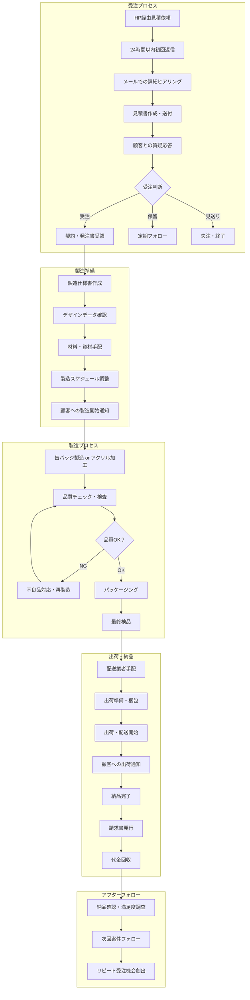

# 第2フェーズ ビジネスフロー図（受注から納品まで）

## リビジョン履歴

| version | date | Auther | Summary | Status | Reviewer |
|------------|------|--------|----------|----------|--------|
| v1.0 | 2025-07-22 | 山下 | Phase2版初版作成 | 🔄 レビュー中 | 尾崎さん（確認予定） |
| - | - | - | - | - | - |

## 2. ビジネスフロー全体図

---

## 3. 各プロセス詳細

### 3.1 受注プロセス（1-3日）

| ステップ | 担当者 | 所要時間 | 備考 |
|----------|--------|----------|------|
| HP経由見積依頼 | 顧客 | - | Webフォーム経由 |
| 24時間以内初回返信 | 尾崎さん | 24時間以内 | 基本情報確認・ヒアリング項目送付 |
| 詳細ヒアリング | 尾崎さん | 1-2日 | 数量・仕様・納期・予算等 |
| 見積書作成・送付 | 橋本さん | 1日 | 正式見積書・製造仕様書 |
| 質疑応答 | 尾崎さん | 1-2日 | メールでの調整 |
| 受注判断 | 顧客 | 3-7日 | 社内検討期間 |

### 3.2 製造準備（2-3日）

| ステップ | 担当者 | 所要時間 | 備考 |
|----------|--------|----------|------|
| 契約・発注書受領 | 尾崎さん | 1日 | 契約書締結 |
| 製造仕様書作成 | 橋本さん | 1日 | 詳細製造指示書 |
| デザインデータ確認 | 製造担当 | 0.5日 | AI形式・解像度チェック |
| 材料・資材手配 | 橋本さん | 1-2日 | 缶バッジ材料・アクリル材料 |
| 製造スケジュール調整 | 橋本さん | 0.5日 | 生産計画組み込み |
| 製造開始通知 | 尾崎さん | 0.5日 | 顧客への進捗連絡 |

### 3.3 製造プロセス（3-7日）

| ステップ | 担当者 | 所要時間 | 備考 |
|----------|--------|----------|------|
| 缶バッジ製造/アクリル加工 | 製造チーム | 2-5日 | 数量により変動 |
| 品質チェック・検査 | 品質管理担当 | 1日 | 全数検査または抜き取り検査 |
| 不良品対応・再製造 | 製造チーム | 1-2日 | 必要に応じて |
| パッケージング | 製造チーム | 0.5-1日 | 個包装・箱詰め |
| 最終検品 | 橋本さん | 0.5日 | 出荷前最終確認 |

### 3.4 出荷・納品（1-3日）

| ステップ | 担当者 | 所要時間 | 備考 |
|----------|--------|----------|------|
| 配送業者手配 | 尾崎さん | 0.5日 | ヤマト運輸・佐川急便等 |
| 出荷準備・梱包 | 製造チーム | 0.5日 | 配送用梱包 |
| 出荷・配送開始 | 配送業者 | 1-2日 | 地域により変動 |
| 出荷通知 | 尾崎さん | 即時 | 追跡番号含む |
| 納品完了 | 顧客 | - | 受領確認 |
| 請求書発行 | 尾崎さん | 1日 | 納品後請求 |
| 代金回収 | 尾崎さん | 30日 | 月末締め翌月末払い |

### 3.5 アフターフォロー（継続）

| ステップ | 担当者 | 所要時間 | 備考 |
|----------|--------|----------|------|
| 納品確認・満足度調査 | 尾崎さん | 3日後 | 品質・サービス確認 |
| 次回案件フォロー | 尾崎さん | 1ヶ月後 | 追加需要確認 |
| リピート受注機会創出 | 尾崎さん | 継続 | 定期的な提案活動 |

