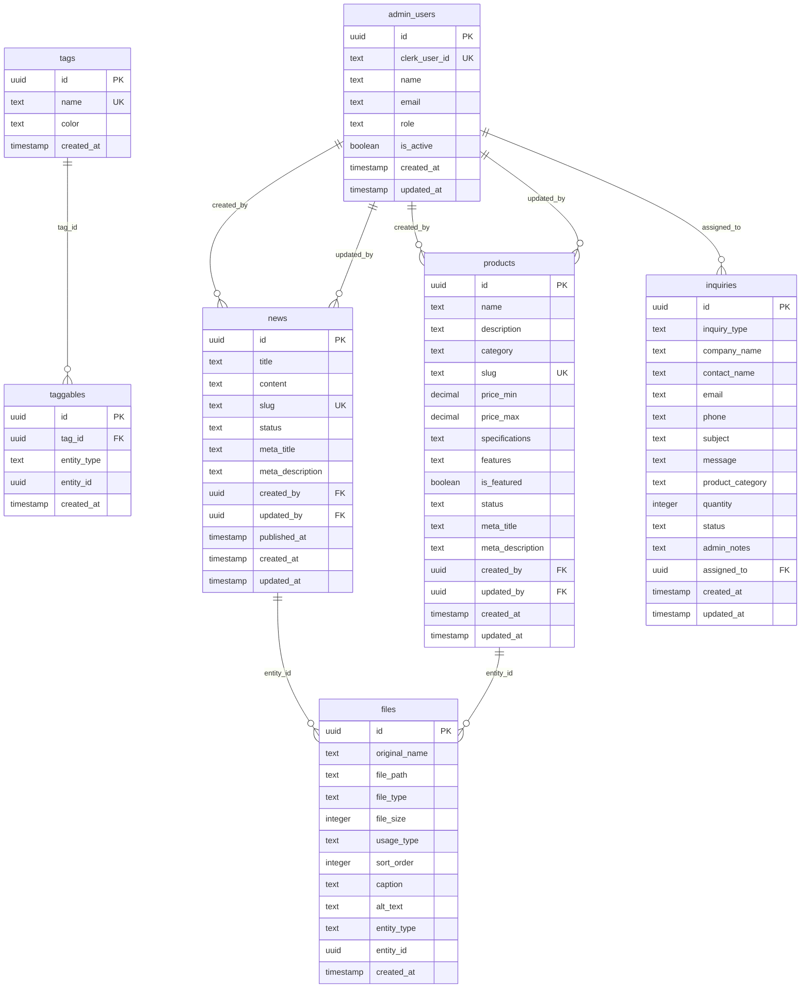

# Phase2データベース設計書

## リビジョン履歴

| Version | Date | Author | Summary | Status | Reviewer |
|------------|------|--------|----------|----------|--------|
| v1.0 | 2025-07-22 | 山下 | Phase2版初版作成 | 🔄 レビュー中 | 橋本 |
| v1.1 | 2025-07-22 | 山下 | SQLAlchemy ORM対応に修正 | 🔄 レビュー中 | 橋本 |

---

## 2. ER図

---

## 3. テーブル定義

### 3.1 admin_users（管理者ユーザー）

| カラム名 | データ型 | 制約 | 説明 |
|----------|----------|------|------|
| id | uuid | **PK**, DEFAULT uuid_generate_v4() | ユーザーID |
| clerk_user_id | text | **UK**, **NN** | Clerk認証のユーザーID |
| name | text | **NN** | 管理者名 |
| email | text | **UK**, **NN** | メールアドレス |
| role | text | **NN**, CHECK(role IN ('admin', 'editor')) | 権限レベル |
| is_active | boolean | **NN**, DEFAULT true | アクティブ状態 |
| created_at | timestamp | **NN**, DEFAULT now() | 作成日時 |
| updated_at | timestamp | **NN**, DEFAULT now() | 更新日時 |

**インデックス**:
- `idx_admin_users_clerk_user_id` ON clerk_user_id
- `idx_admin_users_email` ON email

### 3.2 news（ニュース）

| カラム名 | データ型 | 制約 | 説明 |
|----------|----------|------|------|
| id | uuid | **PK**, DEFAULT uuid_generate_v4() | ニュースID |
| title | text | **NN** | タイトル |
| content | text | **NN** | 記事内容 |
| slug | text | **UK**, **NN** | URLスラッグ |
| status | text | **NN**, DEFAULT 'draft', CHECK(status IN ('draft', 'published', 'archived')) | 公開状態 |
| meta_title | text | | SEO用タイトル |
| meta_description | text | | SEO用説明文 |
| created_by | uuid | **FK** → admin_users(id) | 作成者 |
| updated_by | uuid | **FK** → admin_users(id) | 更新者 |
| published_at | timestamp | | 公開日時 |
| created_at | timestamp | **NN**, DEFAULT now() | 作成日時 |
| updated_at | timestamp | **NN**, DEFAULT now() | 更新日時 |

**インデックス**:
- `idx_news_slug` ON slug
- `idx_news_status` ON status
- `idx_news_published_at` ON published_at

### 3.3 products（商品）

| カラム名 | データ型 | 制約 | 説明 |
|----------|----------|------|------|
| id | uuid | **PK**, DEFAULT uuid_generate_v4() | 商品ID |
| name | text | **NN** | 商品名 |
| description | text | **NN** | 商品説明 |
| category | text | **NN**, CHECK(category IN ('badge', 'acrylic', 'patent', 'other')) | カテゴリ |
| slug | text | **UK**, **NN** | URLスラッグ |
| price_min | decimal(10,2) | | 最低価格 |
| price_max | decimal(10,2) | | 最高価格 |
| specifications | text | | 仕様詳細 |
| features | text | | 特徴・強み |
| is_featured | boolean | **NN**, DEFAULT false | 注目商品フラグ |
| status | text | **NN**, DEFAULT 'active', CHECK(status IN ('active', 'inactive', 'discontinued')) | 状態 |
| meta_title | text | | SEO用タイトル |
| meta_description | text | | SEO用説明文 |
| created_by | uuid | **FK** → admin_users(id) | 作成者 |
| updated_by | uuid | **FK** → admin_users(id) | 更新者 |
| created_at | timestamp | **NN**, DEFAULT now() | 作成日時 |
| updated_at | timestamp | **NN**, DEFAULT now() | 更新日時 |

**インデックス**:
- `idx_products_slug` ON slug
- `idx_products_category` ON category
- `idx_products_status` ON status
- `idx_products_is_featured` ON is_featured

### 3.4 inquiries（問い合わせ）

| カラム名 | データ型 | 制約 | 説明 |
|----------|----------|------|------|
| id | uuid | **PK**, DEFAULT uuid_generate_v4() | 問い合わせID |
| inquiry_type | text | **NN**, CHECK(inquiry_type IN ('estimate', 'general', 'sample')) | 問い合わせ種別 |
| company_name | text | | 会社名 |
| contact_name | text | **NN** | 担当者名 |
| email | text | **NN** | メールアドレス |
| phone | text | | 電話番号 |
| subject | text | **NN** | 件名 |
| message | text | **NN** | 内容 |
| product_category | text | CHECK(product_category IN ('badge', 'acrylic', 'patent', 'other')) | 商品カテゴリ |
| quantity | integer | | 希望数量 |
| status | text | **NN**, DEFAULT 'new', CHECK(status IN ('new', 'in_progress', 'replied', 'closed')) | 対応状況 |
| admin_notes | text | | 管理者メモ |
| assigned_to | uuid | **FK** → admin_users(id) | 担当者 |
| created_at | timestamp | **NN**, DEFAULT now() | 受信日時 |
| updated_at | timestamp | **NN**, DEFAULT now() | 更新日時 |

**インデックス**:
- `idx_inquiries_status` ON status
- `idx_inquiries_inquiry_type` ON inquiry_type
- `idx_inquiries_created_at` ON created_at

### 3.5 files（ファイル管理）

| カラム名 | データ型 | 制約 | 説明 |
|----------|----------|------|------|
| id | uuid | **PK**, DEFAULT uuid_generate_v4() | ファイルID |
| original_name | text | **NN** | 元ファイル名 |
| file_path | text | **NN** | Supabase Storageパス |
| file_type | text | **NN** | MIMEタイプ（表示制御・セキュリティ） |
| file_size | integer | **NN** | ファイルサイズ（アップロード制限） |
| usage_type | text | **NN**, CHECK(usage_type IN ('thumbnail', 'inline', 'attachment')) | 用途（サムネイル/記事内/添付） |
| sort_order | integer | | 表示順序（記事内画像用） |
| caption | text | | 画像キャプション |
| alt_text | text | | アクセシビリティ用代替テキスト |
| entity_type | text | **NN**, CHECK(entity_type IN ('news', 'product', 'inquiry')) | 関連エンティティ種別 |
| entity_id | uuid | **NN** | 関連エンティティID |
| created_at | timestamp | **NN**, DEFAULT now() | アップロード日時 |

**インデックス**:
- `idx_files_entity` ON (entity_type, entity_id)
- `idx_files_usage_order` ON (entity_type, entity_id, usage_type, sort_order)

### 3.6 tags（タグ）

| カラム名 | データ型 | 制約 | 説明 |
|----------|----------|------|------|
| id | uuid | **PK**, DEFAULT uuid_generate_v4() | タグID |
| name | text | **UK**, **NN** | タグ名 |
| color | text | | 表示色（HEXコード） |
| created_at | timestamp | **NN**, DEFAULT now() | 作成日時 |

**インデックス**:
- `idx_tags_name` ON name

### 3.7 taggables（汎用タグ関連）

| カラム名 | データ型 | 制約 | 説明 |
|----------|----------|------|------|
| id | uuid | **PK**, DEFAULT uuid_generate_v4() | 関連ID |
| tag_id | uuid | **FK** → tags(id), **NN** | タグID |
| entity_type | text | **NN**, CHECK(entity_type IN ('news', 'product', 'achievement')) | 対象エンティティ種別 |
| entity_id | uuid | **NN** | 対象エンティティID |
| created_at | timestamp | **NN**, DEFAULT now() | 関連付け日時 |

**制約**:
- UNIQUE(tag_id, entity_type, entity_id) - 重複防止

**インデックス**:
- `idx_taggables_tag` ON tag_id
- `idx_taggables_entity` ON (entity_type, entity_id)
- `idx_taggables_unique` ON (tag_id, entity_type, entity_id) UNIQUE

---

---

**更新日**: 2025年7月22日  
**ステータス**: v1.1・SQLAlchemy ORM対応  
**総テーブル数**: 7テーブル（管理系1、コンテンツ系4、業務系1、ファイル系1）