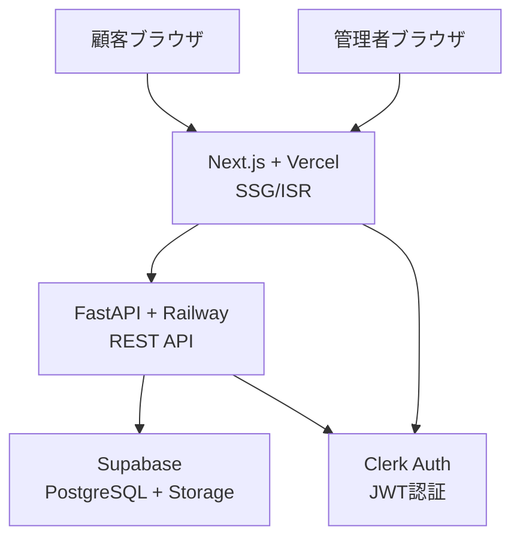
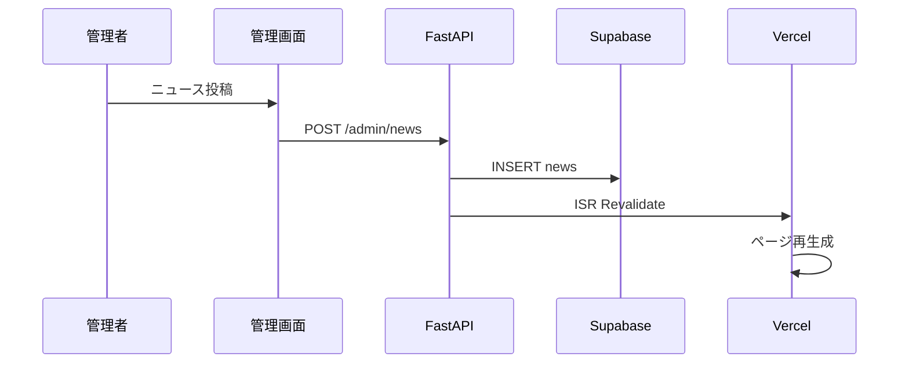
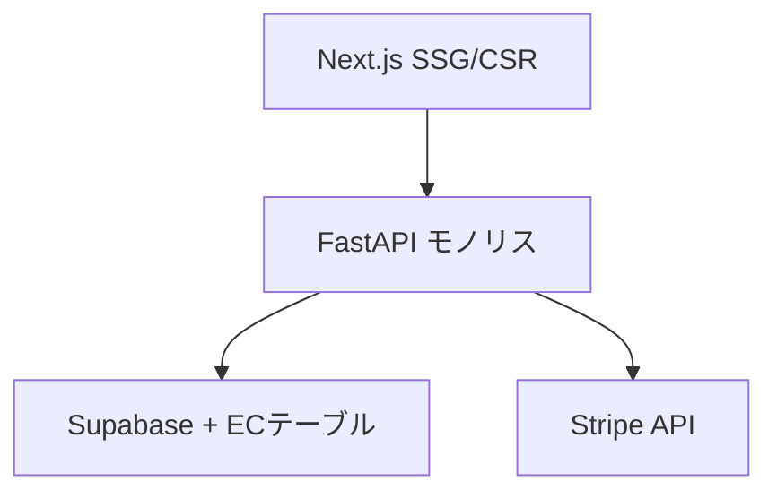

# ZIGZAGLAB Phase2 アーキテクチャ提案書

## リビジョン履歴

| Version | Date | Author | Summary | Status | Reviewer |
|------------|------|--------|----------|----------|--------|
| v1.1 | 2025-07-22 | 山下 | シンプル構成に修正 | 🔄 レビュー中 | 橋本 |

---

## 1. 要件整理

### 1.1 ビジネス要件
- **現在**: Phase2 toB向けホームページ
- **将来**: Phase3 BtoC向けECサイト拡張
- **運用**: 管理者3名（橋本、山下、尾崎）
- **目的**: 学習を兼ねた自作システム構築

### 1.2 技術要件
- **SEO重要**: 「缶バッジ」「アクリル」での検索上位
- **画像管理**: 記事内複数画像挿入
- **タグ機能**: ニュース・商品・実績共通
- **問い合わせ管理**: ステータス管理・担当者アサイン
- **セキュリティ**: Clerk認証、管理者限定

---

## 2. 推奨アーキテクチャ

### 2.1 システム構成



### 2.2 技術スタック

#### フロントエンド
- **Framework**: Next.js 15 (App Router)
- **Hosting**: Vercel Pro（既存）
- **Strategy**: SSG + ISR（公開サイト）、CSR（管理画面）
- **Styling**: Tailwind CSS
- **State**: React Hook Form + SWR

#### バックエンド
- **Framework**: FastAPI
- **Hosting**: Railway Hobby（既存）
- **Database**: Supabase Pro（既存）
- **Storage**: Supabase Storage
- **Auth**: Clerk

---

## 3. レンダリング戦略

### 3.1 公開サイト（SEO重視）
```typescript
// SSG: ビルド時に静的生成
export default async function NewsPage() {
  const news = await getPublishedNews();
  return <NewsPage news={news} />;
}

// ISR: 1時間キャッシュ、コンテンツ更新時に再生成
export const revalidate = 3600;
```

### 3.2 管理画面（UX重視）
```typescript
// CSR: 動的データフェッチ
'use client';
export default function AdminDashboard() {
  const { data } = useSWR('/api/admin/dashboard', fetcher);
  return <Dashboard data={data} />;
}
```

---

## 4. API設計

### 4.1 エンドポイント構成
```python
# main.py
from fastapi import FastAPI, Depends
from .auth import verify_admin

app = FastAPI()

# パブリックAPI
app.include_router(news.public_router, prefix="/news")
app.include_router(products.public_router, prefix="/products")
app.include_router(inquiries.router, prefix="/inquiries")

# 管理者API
app.include_router(
    news.admin_router, 
    prefix="/admin/news",
    dependencies=[Depends(verify_admin)]
)
```

### 4.2 認証フロー
```
1. Clerk → JWT発行
2. FastAPI → JWT検証
3. Supabase → RLS適用
```

---

## 5. データフロー

### 5.1 コンテンツ更新


---

## 6. Phase3 拡張計画

### 6.1 追加機能
- 一般ユーザー登録（usersテーブル）
- 注文管理（orders, order_itemsテーブル）
- 決済連携（Stripe）
- カート機能（Next.js CSR）

### 6.2 アーキテクチャ変更


---

## 7. 開発・運用

### 7.1 環境
```yaml
開発: localhost + Supabaseローカル
本番: Vercel + Railway + Supabase
```

### 7.2 デプロイフロー
```
GitHub push → Vercel自動デプロイ（フロント）
GitHub push → Railway自動デプロイ（バック）
```

### 7.3 基本的な監視
- Vercel Analytics（アクセス解析）
- Railway Metrics（API監視）
- Supabase Dashboard（DB監視）

---

## 8. コスト

### 8.1 既存プラン活用
| サービス | プラン | 月額 | 状況 |
|----------|--------|------|------|
| Vercel | Pro | $20 | 既存 |
| Railway | Hobby | $5 | 既存 |
| Supabase | Pro | $25 | 既存 |
| Clerk | 無料枠 | $0 | 3名まで無料 |

**月額合計**: $50（既存プランなので追加コストなし）

---

## 9. 開発計画

### 9.1 Phase2開発（6週間）
```
Week 1: 環境構築・基盤
Week 2-3: ニュース・商品CRUD
Week 4: 管理画面・認証
Week 5: ファイルアップロード・タグ
Week 6: SEO最適化・テスト
```

### 9.2 技術習得目標
- Next.js App Router
- FastAPI実践
- Supabase活用
- Clerk認証連携

---

## 10. 最小構成での開始

### 10.1 MVP機能
- ✅ 公開ニュース・商品表示（SSG）
- ✅ 管理画面CRUD（CSR）
- ✅ Clerk認証
- ✅ 基本的なファイルアップロード

### 10.2 段階的機能追加
1. タグ機能
2. 画像管理強化
3. SEO最適化
4. 統計ダッシュボード

---

**更新日**: 2025年7月22日  
**ステータス**: v1.1・シンプル版  
**開発期間**: 6週間  
**追加コスト**: $0（既存プラン活用）